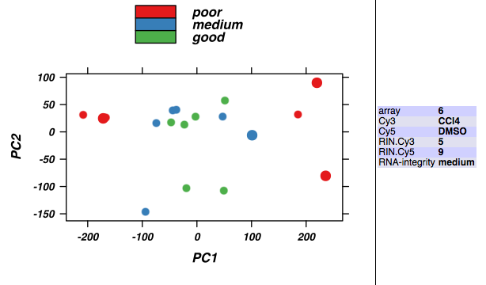
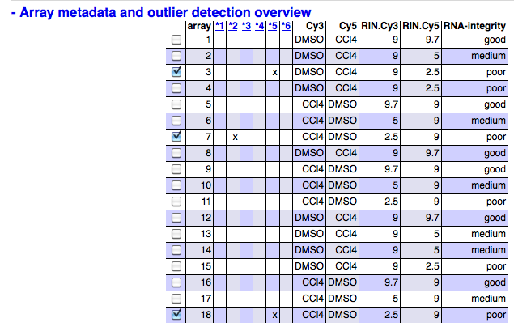

```{r style, eval=TRUE, echo=FALSE, results="asis"}
knitr::opts_chunk$set(message=FALSE, warning=FALSE, error=FALSE, tidy=FALSE) # turn off verbosity
```

## Introduction

The `{arrayQualityMetrics}` package produces, through a single
function call, a comprehensive HTML report of *quality metrics*
about a microarray
dataset [@Kauffmann:2009a:Bioinf,@Kauffmann:2010:Genomics,@McCall2010].
The quality metrics are mainly on the *per array* level,
i.e., they can be used to assess the relative quality of different
arrays within a dataset. Some of the metrics can also be used to
diagnose batch effects, and thus the quality of the overall dataset.

The report can be extended to contain further diagnostics through
additional arguments, and we will see examples for this in Section \@ref(sec:ext).

The aim of the `{arrayQualityMetrics}` package is to produce
information that is relevant for your decision making - not, to make
the decision. It will often be applied to two, somewhat distinct, use
cases: (i) assessing quality of a ``raw'' dataset, in order to get
feedback on the experimental procedures that produced the data; (ii)
assessing quality of a normalised dataset, in order to decide whether
and how to use the dataset (or subsets of arrays in it) for subsequent
data analysis.

Different types of microarray data (one colour, two colour,
Affymetrix, Illumina) are represented by different object classes
in Bioconductor. The function `arrayQualityMetrics()` will
work in the same way for all of them. Further information about
its arguments can be found in its manual page.

When the function `arrayQualityMetrics()` is finished, a
report is produced in the directory specified by the function's
`outdir` argument. By default, a directory with a suitable name
is created in the current working directory. This directory contains
an HTML page `index.html` that can be opened by a browser. The
report contains a series of plots explained by text.  Some of the
plots are interactive (see Figure \@ref(fig:svgplots)). Technically, this
is achieved by the use of SVG (scalable vector graphics) and
JavaScript, and it requires that you use a recent (HTML5 capable) web
browser [^1].  Other plots, where interactivity is less relevant,
are provided as bitmaps (PNG format) and are also linked to PDF files
that provide high resolution versions e.,g. for publication.

[^1]: If in doubt, please see the notes about browser
  compatibility at the top of the report; or contact the Bioconductor
  mailing list.

Plus (+) or minus (-) symbols at the begin of different section
headings of the report (as in the left panel of
Figure \@ref(fig:svgplots)) indicate that you can show or hide these
sections by clicking on the heading. After (re)loading, all sections
are shown except for the *Outlier detection* barplots, which are
hidden and can be expanded by clicking on them.

```{r}
#| out.width: "49%"
#| fig.show: "hold"
#| fig.cap: |
#|   An example plot from the
#|   report. The plot shows the arrays (points) in a two-dimensional
#|   plot area spanned by the first two axes of a principal component
#|   analysis (PCA). By moving the mouse over the points, the
#|   corresponding array's metadata is displayed in the table to the
#|   right of the plot. By clicking on a point, it can be selected or
#|   deselected. Selected arrays are indicated by larger points or
#|   wider lines in the plots and by ticked checkboxes in the array
#|   table shown in the *right* panel. Arrays can also be
#|   (de)selected by clicking the checkboxes.  Initially, when the
#|   report is loaded (or reloaded) by the browser, all arrays are
#|   selected that were called outliers by at least one criterion.


```

Metadata about the arrays is shown at the top of the report as a table
(see Figure \@ref(fig:svgplots)).  It is extracted from the
`phenoData` slot of the data object supplied to
`arrayQualityMetrics()`.  It can be useful to adjust the
contents this slot before producing the report, and to make sure it
contains the right quantity of information to make an informative
report - not too much, not too little.

In the case of `AffyBatch` input, some Affymetrix specific
sections are added to the standard report. Also for other types of
arrays, sections can be added to the standard report if certain
metadata are present in the input object (see Section \@ref(sec:ext)).

The function `arrayQualityMetrics()` also produces an R object
(essentially, a big list) with all the information contained in the
report, and this object can be used by downstream tools for
programmatic analysis of the report. This is discussed in the vignette
\emph{Advanced topics: Customizing arrayQualityMetrics reports and
  programmatic processing of the output}

## Basic use
```{r options, include=FALSE}
##options(error = recover, warn = 2)
options(bitmapType = "cairo")
```


### Affymetrix data - before preprocessing

If you are working with Affymetrix GeneChips, an `AffyBatch` object
is the most appropriate way to import your raw data into Bioconductor.
Starting from CEL files, this is typically done using the function
`ReadAffy()` from the `{affy}` package [^2]

[^2]: For more information on how to produce an `AffyBatch` from your data, please see the documentation of the `{affy}` package.

Here, we use the
dataset *MLL.A*, an object of class `AffyBatch`
provided in the data package `{ALLMLL}`.

```{r DataLoading}
library("ALLMLL")
data("MLL.A")
```

Now that the data are loaded, we can call
`arrayQualityMetrics()` [^3].

[^3]: For this vignette, in order to save
computation time, we only call the function on the first 5 arrays; in
your own application, you can call it on the complete data object.

```{r AffyBatchQM, results="hide"}
library("arrayQualityMetrics")
arrayQualityMetrics(expressionset = MLL.A[, 1:5],
                    outdir = "Report_for_MLL_A",
                    force = TRUE,
                    do.logtransform = TRUE)
```

This is the simplest way of calling the function. We give a name to
the directory (`outdir`) and we overwrite the possibly existing
files of this directory (`force`). Finally, we set
`do.logtransform` to logarithm transform the intensities. You
can then view the report by directing your browser to the file
`index.html` in the directory whose name is indicated by
`outdir`.

### Affymetrix data - after preprocessing

We can call the RMA algorithm on *MLL.A* to obtain a preprocessed
dataset.  The preprocessing includes background correction, between
array intensity adjustment (normalisation) and probeset
summarisation. The resulting object `nMLL` is of class
`ExpressionSet` and
contains one value (expression estimate) for each gene
for each array.

```{r Normalisation, results="hide"}
nMLL = rma(MLL.A)
```

We can then call again the function `arrayQualityMetrics()`.

```{r ExpressionSet}
arrayQualityMetrics(expressionset = nMLL,
                    outdir = "Report_for_nMLL",
                    force = TRUE)
```

We do not need to set `do.logtransform` as after
`rma()` the data are already logarithm transformed.

### ExpressionSet and ExpressionSetIllumina

If you are working on one colour arrays other than Affymetrix
genechips, you can load your data into Bioconductor as an
`ExpressionSet` object \footnote{See the documentation of the
  `{Biobase}` package.}, or if you work with Illumina data and the
`{beadarray}` package, as an `ExpressionSetIllumina` object.
You can then proceed exactly as above.


### Two colour arrays, NChannelSet, RGList, MAList

The package `{limma}` imports a wide range of data formats used
for two colour arrays and produces objects of class `RGList` or
`MAList`. When presented with an object of these classes,
`arrayQualityMetrics()` tries to convert them into an
`NChannelSet` and then proceeds with calling its
`NChannelSet` method.

Alternatively, you can create an `NChannelSet` to contain your
data ``from scratch''. The documentation of the `{Biobase}`
package gives instructions on how to do so.

The `arrayQualityMetrics()` function expects the
`assayData` slot of the `NChannelSet` object to contain
the elements `R` and `G`, for the ``red'' and the
``green'' intensities. Optionally, it can contain elements
`Rb` and `Gb` for associated ``background''
intensities.  As an alternative to all that, the
`arrayQualityMetrics()` function also accepts
`NChannelSet` objects with a single slot `exprs`, and
will then simply behave like it does for (single-colour)
`ExpressionSet` objects.

As an example, we consider the dataset `CCl4` from the data package
`{CCl4}` and normalize it using the variance stabilization
method available in the package `{vsn}`.

```{r NChannelSet1, results="hide"}
library("vsn")
library("CCl4")
data("CCl4")
nCCl4 = justvsn(CCl4, subsample = 15000)
arrayQualityMetrics(expressionset = nCCl4,
                    outdir = "Report_for_nCCl4",
                    force = TRUE)
```

### Loading data from ArrayExpress

You can use the `{ArrayExpress}`
package [@Kauffmann:2009b:Bioinf] to download datasets from the
EBI's ArrayExpress database. The resulting `ExpressionSet`,
`AffyBatch` or `NChannelSet` objects can be directly fed
into `arrayQualityMetrics()`.


## Making the report more informative by adding a factor of interest

A useful feature of `arrayQualityMetrics()` is the possibility
to show the results in the context of an experimental factor of
interest, i.,e. a categorical variable associated with the arrays
such as *hybridisation date*, *treatment level* or
*replicate number*. Specifying a factor does *not* change
how the quality metrics are computed. By setting the argument
`intgroup()` to contain the names of one or multiple columns
of the data object's `phenoData` slot\footnote{This is where
  Bioconductor objects store array annotation}, a bar on the side of
the heatmap with colours representing the respective factors is added.
Similarly, the colours of the boxplots and density plots reflect the
levels of the first of the factors named by `intgroup()`.

We use the *nMLL* example again, and create artificial
array metadata factors `condition` and
`batch` (see Section~\@ref(sec:rin) for a more realistic example).

```{r intgroup1}
pData(nMLL)$condition = rep(letters[1:4], times = 5)
pData(nMLL)$batch = rep(paste(1:4), each = 5)
```

```{r intgroup2}
arrayQualityMetrics(expressionset = nMLL,
                    outdir = "Report_for_nMLL_with_factors",
                    force = TRUE,
                    intgroup = c("condition", "batch"))
```

## Extended use
{#sec:ext}

Some of the quality metrics that the package can compute require
specific information about the features on the arrays.  To use these,
you need to make sure that this information is provided in your input
object.  We use the *nCCl4* example again.

### Spatial layout of the array
{#sec:spatial}

To plot the spatial distributions of the intensities of the arrays,
`arrayQualityMetrics()` needs the spatial coordinates of the
features on the chip. For `AffyBatch` or
`BeadLevelList`, this information is automatically available
without further user input. For the other types of objects, two
columns corresponding to $X$ and $Y$ coordinates of the features are
required in the `featureData` slot of the object.  These
columns should be named "X" and "Y". If the arrays are split into
blocks, rows and columns, then the function `addXYfromGAL()`
(please check its manual page for details) can used to convert the
row, column and blocks indices into absolute "X" and "Y" coordinates on the
array. In the example of the dataset `CCl4`, the coordinates of
the spots are in the columns named "Row" and "Column" of the
featureData (the slot of the object containing the annotation of the
probes). We copy this information into columns named "X"
and "Y" respectively

```{r XYcoordinates}
featureData(nCCl4)$X = featureData(nCCl4)$Row
featureData(nCCl4)$Y = featureData(nCCl4)$Column
```

The next call to `arrayQualityMetrics()` with this refined version of
`nCCl4` (see Section~\@ref(sec:rin)) will now
include this information in the report, and the spatial distribution
of the intensities will be shown.

### Mapping of the reporters

The report can also include an assessment of the effect of the target
mapping of the reporters. You can define a `featureData` column
named `hasTarget` that indicates, by logical `TRUE`, if
the reporter matches a known transcript, and by `FALSE`, if
not. In the *CCl4* example, many of the reporter names are RefSeq
identifiers, while others are not. Thus, we let `hasTarget`
indicate whether the name begins with "NM".

```{r hasTarget}
featureData(nCCl4)$hasTarget = (regexpr("^NM", featureData(nCCl4)$Name) > 0)
table(featureData(nCCl4)$hasTarget)
```

The next call to `arrayQualityMetrics()` with this refined version of
`nCCl4` (see Section \@ref(sec:rin)) will now
include this information in the report, and the spatial distribution
of the intensities will be shown.

<!--
### GC content of the reporters
If the GC content of the reporters is known, then it is possible to
indicate that in the `featureData` slot of the
`NChannelSet` object under the column name "GC". Then a study of the
GC content effect on intensities of the arrays can be performed. In
the *CCl4* example we do not have this information. However, the
process would be very similar to what is done with the "hasTarget"
column. 
-->

### RNA quality
{#sec:rin}

The RNA hybridized to the arrays in the `{CCl4}` dataset was
intentionally made to good, medium or poor quality, and this is
recorded by a so-called RIN value (see *CCl4* vignette).

```{r pData}
pd = pData(CCl4)
rownames(pd) = NULL
pd
```

The RIN is always 9 for the reference (DMSO), the relevant value is that
for the test sample (CCl4).

```{r RIN}
RIN = with(pd, ifelse( Cy3=="CCl4", RIN.Cy3, RIN.Cy5))
fRIN = factor(RIN)
levels(fRIN) = c("poor", "medium", "good")
pData(nCCl4)$"RNA-integrity" = fRIN
```

Now we can use this to set the argument `intgroup` when
calling the function `arrayQualityMetrics()`.

```{r NChannelSet2}
arrayQualityMetrics(expressionset = nCCl4,
                    outdir = "Report_for_nCCl4_with_RIN",
                    force = TRUE,
                    intgroup = "RNA-integrity")
```

Boxplots, PCA plot and heatmap in the report will now indicate the values
of the factor `RNA-integrity` for each array.

## Session Info

```{r pkgs, echo=FALSE, results="asis"}
sessionInfo()
```

## References
